# AdventureLog — UML Class Diagram

Generated from the current state of [include/](../include/) and [src/](../src/). Stubbed-but-never-defined methods, defined-but-never-called helpers, and the interactive test namespaces are intentionally omitted (see [llm/PROGRESS.md](../llm/PROGRESS.md) for the dead-code accounting).

Layering: `UI` → `State` → `Disk` → models (`User`, `Log` (`CaveLog`/`HikeLog`), `Participant`).

```mermaid
classDiagram
    direction TB

    %% ─────────────── UI layer ───────────────
    class UI {
        -State s
        -User u
        -int menu
        -int page
        -bool loop
        +UI(string path)
        +run() void
        -startupMenu() int
        -mainMenu() int
        -logMenu() bool
        -quitMenu() bool
        -logIn() bool
        -signUp() bool
        -viewLog(size_t) bool
        -logCreator() bool
        -userSettings() bool
        -openPage(size_t pageNum, size_t oldPage) void
        +sortID(vector~Log*~) vector~Log*~$
        +sortDuration(vector~Log*~) vector~Log*~$
        -takeInput(string_view) string$
        -takeInput(string_view, string&) string$
        -takeUIntInput(string_view) size_t$
        -takeUIntInput(string_view, size_t&) size_t$
        -takeBoolInput(string_view) bool$
        -takeBoolInput(string_view, bool&) bool$
        -takeMCQ(vector~string~) size_t$
        -resetInputStream(istream&) void$
        -print(string_view) void$
        -printl(string_view) void$
        -printErr(string_view) void$
        -printHeader(string_view) void$
    }

    %% ─────────────── State layer ───────────────
    class State {
        -vector~User*~ users
        -Disk disk
        -User* currentUser
        +string defaultDiskPath$
        +State(string path)
        +~State()
        +getUsers() vector~User*~
        +setUsers(vector~User*~) void
        +getCurrentUser() User*
        +setCurrentUser(User*) void
        +addUser(User*) void
        +removeUser(User*) void
        +createUser(string username, string password) void
        +logIn(string username, string password) bool
        +isUniqueUsername(string) bool
        +loadSave(string path) void
        +save() void
    }

    %% ─────────────── Disk layer ───────────────
    class Disk {
        #string filePath
        #ifstream diskFile
        #vector~string~ diskContents
        #KeyValueList attributes
        #ObjectList objects
        #vector~User*~ users
        #vector~Log*~ logs
        #vector~Participant*~ participants
        #vector~string~ writeBuffer
        #ofstream writeFile
        #size_t objLineNum
        #splitByObjects(KeyValueList&) ObjectList
        +Disk(string diskPath)
        +~Disk()
        +getFilePath() string
        +setFilePath(string) void
        +getDiskFile() ifstream&
        +getUsers() vector~User*~&
        +getLogs() vector~Log*~&
        +getParticipants() vector~Participant*~&
        +addUser(User*) void
        +addLog(Log*) void
        +addParticipant(Participant*) void
        +removeUser(User*) void
        +openFile(string_view) void
        +isFileGood() bool
        +readFileContents(string_view) vector~string~
        +parseDisk(string_view) void
        +initUser(KeyValueList) User*
        +initLog(KeyValueList) Log*
        +initParticipant(KeyValueList) Participant*
        +loadParticipants(size_t) vector~Participant*~
        +loadLogs(size_t, vector~Participant*~) vector~Log*~
        +loadUsers(size_t, vector~Log*~) vector~User*~
        +loadFromDisk(string) void
        +updateMaxId(vector~Participant*~) size_t
        +updateMaxId(vector~Log*~) size_t
        +updateMaxId(vector~User*~) size_t
        +userToStr(User*) vector~string~
        +logToStr(Log*) vector~string~
        +partToStr(Participant*) vector~string~
        +writeToDisk(vector~string~) void
    }

    class DiskAccessError {
        <<exception>>
    }

    %% ─────────────── Models ───────────────
    class User {
        -int id
        -int numUsers$
        -string name
        -string passwd
        -vector~Log*~ logs
        +User()
        +User(string name)
        +User(string name, string passwd)
        +~User()
        +getId() int
        +getName() string
        +getPasswd() string
        +getLogs() vector~Log*~
        +setID(int) void
        +setName(string) void
        +setPasswd(string) void
        +setLogs(vector~Log*~) void
        +print() void
        +printAll() void
        +generateID() void
        +setNumUsers(int)$ void
        +addLog(Log*) void
        +removeLog(Log*) void
    }

    class Log {
        <<abstract>>
        #int id
        #int durationMins
        #string area
        #vector~Participant*~ participants
        #string note
        #string date
        #int numLogs$
        #int userId
        +Log()
        +Log(int uid, string date)
        +Log(int uid, string date, string note)
        +Log(int uid, string date, string area, string note)
        +Log(int uid, string date, string area, string note, vector~Participant*~)
        +~Log() virtual
        +getId() int
        +getUserId() int
        +getDurationMins() int
        +getArea() string
        +getNote() string
        +getDate() string
        +getParticipants() vector~Participant*~
        +setID(int) void
        +setUserId(int) void
        +setDurationMins(int) void
        +setDuration(int hours, int mins) void
        +setArea(string) void
        +setNote(string) void
        +setDate(string) void
        +setParticipants(vector~Participant*~) void
        +print() void virtual
        +generateID(int& numObject) void
        +setNumLogs(int)$ void
        +addParticipant(Participant*) void
        +removeParticipant(Participant*) void
        +sortByID(Log*, Log*) bool$
        +sortByDuration(Log*, Log*) bool$
    }

    class CaveLog {
        -string name
        -bool isSRT
        -bool wasCL
        -bool didRigging
        +string type$
        +CaveLog()
        +CaveLog(int uid, string name, string date)
        +CaveLog(int uid, string name, string date, string area, string note)
        +CaveLog(int uid, string name, string date, string area, string note, vector~Participant*~, bool isSRT, bool wasCL, bool wasRigg)
        +getName() string
        +isSRTCave() bool
        +wasCaveLeader() bool
        +wasRigger() bool
        +setName(string) void
        +setSRTCave(bool) void
        +setCaveLeader(bool) void
        +setRigger(bool) void
        +print() void
    }

    class HikeLog {
        -int distance
        -string weather
        +string type$
        +HikeLog()
        +HikeLog(int uid, string date)
        +HikeLog(int uid, string date, string note)
        +HikeLog(int uid, string date, string area, string note, int distance)
        +HikeLog(int uid, string date, string area, string note, int distance, string weather, vector~Participant*~&)
        +getDist() int
        +getWeather() string
        +setDist(int) void
        +setWeather(string) void
        +print() void
    }

    class Participant {
        -string name
        -int id
        -int logId
        -int numParticipants$
        -generateID() int
        +Participant(string name)
        +Participant(string name, int logID)
        +Participant(string name, int logID, int id)
        +getId() int
        +getLogId() int
        +getName() string
        +getNumParticipants() int
        +setID(int) void
        +setLogID(int) void
        +setName(string) void
        +setNumParticipants(int)$ void
        +print() void
    }

    %% ─────────────── Free-function namespace ───────────────
    class DiskHelper {
        <<namespace>>
        +getKey(KeyValue&) string
        +getVal(KeyValue&) string
        +getAttrValue(KeyValueList&, size_t) string
        +getAttrKey(KeyValueList&, size_t) string
        +getKeyLocationInObj(string_view, KeyValueList&) size_t
        +strToNum(string&) ulong
        +printl(string_view) void
        +printErr(string_view) void
        +printObject(KeyValueList&) void
        +printObjectKVL(ObjectList&) void
        +doesSubstrExist(string_view, string_view) bool
        +strToKVPair(string_view) KeyValue
        +StrVecToKVL(vector~string~&) KeyValueList
        +strToBool(string_view) bool
        +intToStr(int) string
        +boolToStr(bool) string
        +openDiskForWriting(ofstream&, string) void
    }

    %% ─────────────── Relationships ───────────────
    %% Inheritance
    Log <|-- CaveLog
    Log <|-- HikeLog
    DiskAccessError --|> RuntimeError : extends

    %% Composition (owned by-value member)
    UI *-- State : s
    State *-- Disk : disk

    %% Aggregation (pointer-based ownership; same pointers tracked elsewhere)
    State o-- "0..*" User : users
    Disk o-- "0..*" User : users
    Disk o-- "0..*" Log : logs
    Disk o-- "0..*" Participant : participants
    User o-- "0..*" Log : logs
    Log o-- "0..*" Participant : participants

    %% Weak references (non-owning pointer / handle)
    State ..> User : currentUser
    Log ..> User : userId (by id)
    Participant ..> Log : logId (by id)

    %% Dependencies
    Disk ..> DiskAccessError : throws
    State ..> DiskAccessError : catches
    Disk ..> DiskHelper : uses
    State ..> DiskHelper : uses
    UI ..> Log : sorts via sortByID/sortByDuration

    class RuntimeError {
        <<std::runtime_error>>
    }
```

## Legend

| Symbol | Meaning |
| ------ | ------- |
| `<\|--` | Inheritance |
| `*--` | Composition (owned by-value member) |
| `o--` | Aggregation (pointer-based ownership) |
| `..>` | Dependency / weak reference / by-id reference |
| `+` / `-` / `#` | public / private / protected |
| `$` (suffix) | static |
| `<<abstract>>` | conceptually abstract (instantiated only via `CaveLog`/`HikeLog`) |

## Notes on the relationships

- **`UI *-- State` and `State *-- Disk`** are by-value composition — the inner object's lifetime is bounded by the outer's. The strict layering (`UI → State → Disk → models`) follows from this: each layer holds the next as a value member, never the reverse.
- **`User`/`Log`/`Participant` are pointer-aggregated in three places**: `Disk` (the lifetime owner via raw `delete` in `~Disk`), `State::users` (sharing the same `User*` after `users = disk.getUsers()`), and the parent-side `User::logs` / `Log::participants` (which call `delete` in *their* destructors during cascade ownership). The diagram shows all three edges as aggregation rather than composition, because no single edge owns the lifetime alone.
- **By-id back-references** (`Log::userId`, `Participant::logId`) are shown as dotted dependencies, not aggregation — they're plain `int` fields, not pointers, and exist primarily so the on-disk format can reconstruct the graph in `Disk::loadFromDisk`.
- **`DiskAccessError`** extends `std::runtime_error` (shown as a stand-in `RuntimeError` class with the `<<std::runtime_error>>` stereotype, since Mermaid can't model an external std-library type cleanly).
