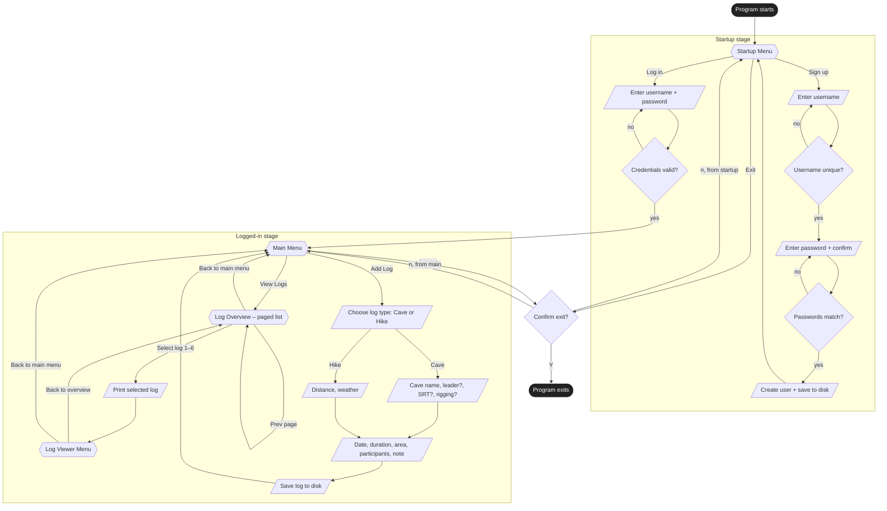

# AdventureLog — User Journey Map

A high-level map of every path a user can take through the program, grouped by stage. Sourced from the menu loop in [src/UI.cpp](../src/UI.cpp). Stub / unimplemented options (settings, edit log, delete log, sort) are omitted — see [llm/PROGRESS.md](../llm/PROGRESS.md).

## Legend

| Shape | Meaning |
| ----- | ------- |
| `([rounded])` | Program entry / exit |
| `{{hex}}` | Menu — user picks an option |
| `{diamond}` | Decision / validation |
| `[/parallelogram/]` | User input or system action |

## Notes on the flow

- **Sign-up returns to the Startup Menu**, not the Main Menu. The user must explicitly log in afterwards — the credentials they just created are not auto-applied (see [src/UI.cpp:119-146](../src/UI.cpp#L119-L146)).
- **Log-in retries forever on bad credentials** — `UI::run()` wraps `logIn()` in a `do { ... } while (!loggedIn)` loop ([src/UI.cpp:37-38](../src/UI.cpp#L37-L38)). There is no "give up" path; the only way out from a failed login is to kill the process.
- **`Logout` and `Exit` share the same confirmation prompt** (`quitMenu()` at [src/UI.cpp:65-71](../src/UI.cpp#L65-L71)). On `Y`, the program calls `std::exit(0)` — saves are best-effort via `~State()`. On `n`, control falls back to whichever menu the user came from.
- **Page navigation in the Log Overview wraps**: `Next` past page 100 returns to page 1, `Prev` below page 1 jumps to page 100 ([src/UI.cpp:231-238](../src/UI.cpp#L231-L238)). The user never gets blocked, even when there are no more logs to show.
- **Log creation persists immediately** — `s.save()` is called at the end of `logCreator()` ([src/UI.cpp:430](../src/UI.cpp#L430)), so the new log survives even if the program crashes before the next clean exit. Sign-up does the same ([src/UI.cpp:144](../src/UI.cpp#L144)).
