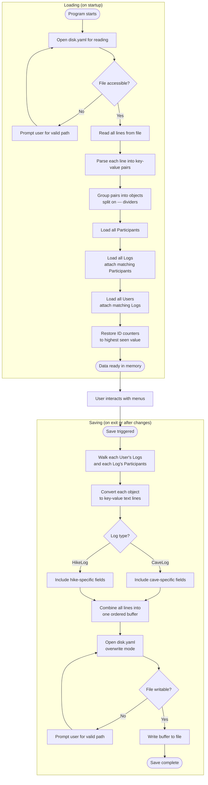

# Data Flow Overview

```mermaid
flowchart TD
    subgraph LOAD["Loading (on startup)"]
        direction TB

        START(["Program starts"]) --> OPEN_READ["Open disk.yaml for reading"]
        OPEN_READ --> FILE_OK{"File accessible?"}
        FILE_OK -- No --> PROMPT_PATH["Prompt user for valid path"]
        PROMPT_PATH --> OPEN_READ
        FILE_OK -- Yes --> READ_LINES["Read all lines from file"]
        READ_LINES --> PARSE["Parse each line into key-value pairs"]
        PARSE --> GROUP["Group pairs into objects<br/>split on --- dividers"]

        GROUP --> LOAD_P["Load all Participants"]
        LOAD_P --> LOAD_L["Load all Logs<br/>attach matching Participants"]
        LOAD_L --> LOAD_U["Load all Users<br/>attach matching Logs"]
        LOAD_U --> IDS["Restore ID counters<br/>to highest seen value"]
        IDS --> READY(["Data ready in memory"])
    end

    subgraph SAVE["Saving (on exit or after changes)"]
        direction TB

        TRIGGER(["Save triggered"]) --> WALK["Walk each User's Logs<br/>and each Log's Participants"]
        WALK --> SERIAL["Convert each object<br/>to key-value text lines"]
        SERIAL --> LOG_TYPE{"Log type?"}
        LOG_TYPE -- CaveLog --> CAVE["Include cave-specific fields"]
        LOG_TYPE -- HikeLog --> HIKE["Include hike-specific fields"]
        CAVE --> COMBINE["Combine all lines into<br/>one ordered buffer"]
        HIKE --> COMBINE
        COMBINE --> OPEN_WRITE["Open disk.yaml<br/>overwrite mode"]
        OPEN_WRITE --> WRITE_OK{"File writable?"}
        WRITE_OK -- No --> PROMPT_SAVE["Prompt user for valid path"]
        PROMPT_SAVE --> OPEN_WRITE
        WRITE_OK -- Yes --> WRITE["Write buffer to file"]
        WRITE --> DONE(["Save complete"])
    end

    READY --> RUN["User interacts with menus"]
    RUN --> TRIGGER
```
pretty please :3