# Data Load & Save Flowchart

```mermaid
flowchart TD
    %% ============================================================
    %% LOAD PIPELINE
    %% ============================================================
    subgraph LOAD["LOAD PIPELINE (Startup)"]
        direction TB

        M["main()"] --> UI_CTOR["UI(path)"]
        UI_CTOR --> STATE_CTOR["State(path)<br/>constructs Disk member"]
        STATE_CTOR --> LOADSAVE["State::loadSave(path)"]
        LOADSAVE --> LOADFROMDISK["Disk::loadFromDisk(path)"]

        LOADFROMDISK --> PARSEDISK["Disk::parseDisk(path)"]

        PARSEDISK --> READFILE["Disk::readFileContents(path)"]
        READFILE --> OPENFILE{"Disk::openFile(path)<br/>file accessible?"}

        OPENFILE -- Yes --> READLINE["getline(diskFile >> ws, line)<br/>for each line"]
        OPENFILE -- No --> THROW_LOAD["throw DiskAccessError"]
        THROW_LOAD --> REPROMPT_LOAD["State ctor catches error<br/>prompts user for new path"]
        REPROMPT_LOAD --> LOADSAVE

        READLINE --> DISKCONTENTS["diskContents<br/>vector&lt;string&gt; of raw lines"]

        DISKCONTENTS --> STRTOKV["Disk::StrVecToKVL()<br/>parse each line on separator ': '"]
        STRTOKV --> ATTRIBUTES["attributes<br/>KeyValueList (flat)"]

        ATTRIBUTES --> SPLITOBJ["Disk::splitByObjects()<br/>split on '---' dividers"]
        SPLITOBJ --> OBJECTS["objects<br/>ObjectList (grouped)"]

        OBJECTS --> LOAD_P["Disk::loadParticipants()<br/>filter object: Participant"]
        LOAD_P --> INIT_P["Disk::initParticipant()<br/>for each Participant block"]
        INIT_P --> PVEC["participants<br/>vector&lt;Participant*&gt;"]

        PVEC --> LOAD_L["Disk::loadLogs(participants)<br/>filter object: CaveLog / HikeLog"]
        LOAD_L --> INIT_L["Disk::initLog()<br/>for each Log block"]
        INIT_L --> WIRE_P["Wire participants<br/>where p->logId == log->id"]
        WIRE_P --> LVEC["logs<br/>vector&lt;Log*&gt;"]

        LVEC --> LOAD_U["Disk::loadUsers(logs)<br/>filter object: User"]
        LOAD_U --> INIT_U["Disk::initUser()<br/>for each User block"]
        INIT_U --> WIRE_L["Wire logs<br/>where l->userId == u->id"]
        WIRE_L --> UVEC["users<br/>vector&lt;User*&gt;"]

        UVEC --> MAXID["updateMaxId() x3<br/>restore User/Log/Participant counters"]
        MAXID --> ASSIGN["State::users = disk.getUsers()<br/>load complete"]
    end

    %% ============================================================
    %% SAVE PIPELINE
    %% ============================================================
    subgraph SAVE["SAVE PIPELINE"]
        direction TB

        TRIGGER{"Save triggered by"}
        TRIGGER -- "explicit" --> EXPLICIT["UI::signUp() or<br/>UI::logCreator()<br/>calls s.save()"]
        TRIGGER -- "destructor" --> DESTR["~State()<br/>calls save()"]

        EXPLICIT --> SAVE_FN["State::save()"]
        DESTR --> SAVE_FN

        SAVE_FN --> WALK["Walk users -> logs -> participants<br/>(parent-first tree traversal)"]

        WALK --> SER_U["Disk::userToStr(u)<br/>for each User"]
        WALK --> SER_L["Disk::logToStr(log)<br/>for each Log"]
        WALK --> SER_PART["Disk::partToStr(p)<br/>for each Participant"]

        SER_L --> CAST{"dynamic_cast<br/>log subtype?"}
        CAST -- CaveLog --> CAVE_STR["Serialize cave-name,<br/>srt-cave, cave-leader, rigging"]
        CAST -- HikeLog --> HIKE_STR["Serialize distance,<br/>weather"]

        SER_U --> BUFS["_users, _logs, _parts<br/>vector&lt;vector&lt;string&gt;&gt;"]
        CAVE_STR --> BUFS
        HIKE_STR --> BUFS
        SER_PART --> BUFS

        BUFS --> ASSEMBLE["Assemble flat buffer<br/>users ++ logs ++ participants"]
        ASSEMBLE --> BUFFER["buffer<br/>vector&lt;string&gt;"]

        BUFFER --> WRITETODISK["Disk::writeToDisk(buffer)"]
        WRITETODISK --> OPENWRITE{"openDiskForWriting()<br/>ios::out | ios::trunc<br/>file writable?"}

        OPENWRITE -- Yes --> WRITELINES["writeFile << line << newline<br/>for each string in buffer"]
        OPENWRITE -- No --> THROW_SAVE["throw DiskAccessError"]
        THROW_SAVE --> REPROMPT_SAVE["~State() catches error<br/>prompts user for new path"]
        REPROMPT_SAVE --> SAVE_FN

        WRITELINES --> CLOSE["writeFile.close()<br/>save complete"]
    end

    %% ============================================================
    %% CONNECT THE TWO PIPELINES
    %% ============================================================
    ASSIGN --> RUN["UI::run()<br/>menu loop"]
    RUN --> TRIGGER
```



## Key design decisions

| Aspect | Load | Save |
|---|---|---|
| **Object order** | Child-first: Participants -> Logs -> Users | Parent-first: Users -> Logs -> Participants |
| **Why** | Parents need children to already exist so references can be wired | Walking the ownership tree from root drops orphans by design |
| **File mode** | `ifstream` (read) | `ofstream` with `ios::trunc` (full rewrite) |
| **Error handling** | `DiskAccessError` -> reprompt in `State` ctor | `DiskAccessError` -> reprompt in `~State()` |

## Data structures through the pipeline

```
disk.yaml (flat text file)
    |
    v  readFileContents()
vector<string>  (raw lines)
    |
    v  StrVecToKVL()
KeyValueList  (flat list of key-value pairs)
    |
    v  splitByObjects()
ObjectList  (grouped by --- dividers)
    |
    v  loadParticipants / loadLogs / loadUsers
vector<User*>  (in-memory object graph with wired relationships)
    |
    v  userToStr / logToStr / partToStr
vector<vector<string>>  (serialized object blocks)
    |
    v  assemble buffer
vector<string>  (flat line list)
    |
    v  writeToDisk()
disk.yaml  (rewritten from scratch)
```
